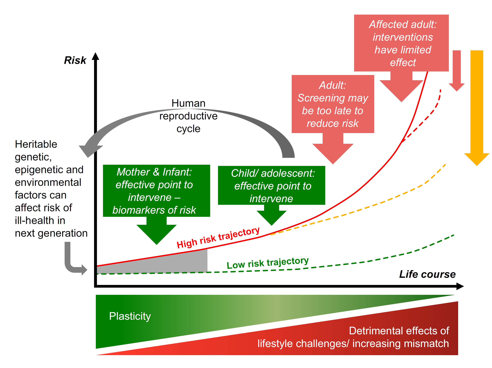
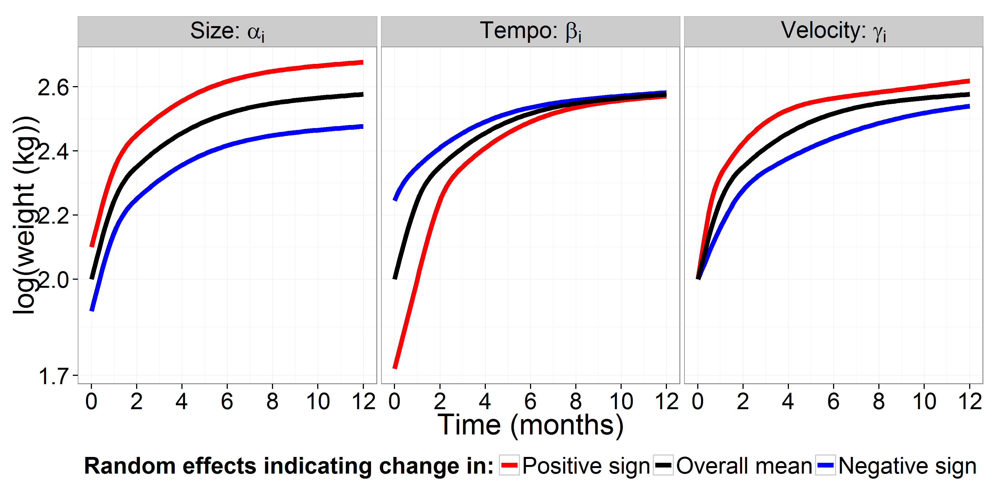

# Significance and Innovation

## CVD and lipids
### CVD and lipids

- CVD is a chronic disease
- Primary modifiable risk factors
- lipid description

## Developmental Origins of Health and Disease
### Developmental Origins of Health and Disease

\centering
  

## Postnatal growth and lipids
### Postnatal growth and lipids

\begin{itemize}
	\item Repeated animal and human studies have shown that postnatal growth is associated with the later development of dyslipidemia.
\end{itemize}
\vspace*{-0.5cm}

\begin{table}[H]
\resizebox{1.25\textwidth}{!}{%
\begin{tabulary}{\textwidth}{Lp{2cm}p{1cm}p{1.75cm}R{1cm}Z{3cm}Z{5cm}Z{4cm}Z{4cm}}
\toprule
	\# & First Author & Year & Country & Sample size & Age at growth measurements & Growth measurement & Outcome measures & Mean age at outcome measures (years (SD)) \\ \hline
	1 & Ekelund & 2007 & Sweden & 128 & 6 months, 1 year, 2 year & Change in weight Z-score between 0 to 6 months & HDL (+), TG (+) & 16.8 (0.4) male; 16.7 (0.4) female \\ 
	2 & Kajantie & 2008 & Finland & 1999 & 0, 3, 6, 9, 12, 15, 18, 21, 24 months & BMI SD scores at 6 months adj. for birthweight & TC (-), HDL (+), non-HDL (-), TG (-) at 6 months & 61.5 (3.0) women; 61.5 (sd=2.8) \\
	3 & Leunissen & 2009 & Netherlands & 200 & 0, 3, 6, 9, 12 months & SD score of weight gain (Z-score?) per 3 month period in first year of life. & HDL-C (-), LDL-C, TG(+), TC (at 0-3 months only) & 20.8 (1.67) \\ 
	4 & Corvalan & 2009 & Chile & 323 & 0, 6, 12, 18, 24 and 36 months & WHO Z-scores difference 0 to 6 months & HDL-C (-), LDL-C (+), TG (+), TC [exclusive bf] & 4 \\ 
	5 & Tzoulaki & 2010 & Finland & 3778 & not specified: during infancy & Peak weight velocity (kg/year) & HDL-C (-), TG (-) & 31 \\ 
	6 & Howe & 2010 & Great Britain & 4601 & 0, 2, 4 months & SD score of ponderal index (PI), kg/m3. change from 0 to 2 months (boys) and 0 to 4 months (girls) & LDL (+), HDL (-), TG (+) & 15 \\ 
	7 & Oostvogels & 2014 & Netherlands & 1459 &  & Change in internal SD score for weight-for-length from 1 to 3 months & HDL-C (-), TG (+) & 5-6  \\ 
\bottomrule
\end{tabulary}%
}
\end{table}

## Postnatal growth as an environmental cue
### Postnatal growth as an environmental cue

* The postnatal period is a critical window of time in which accelerated growth can influence risk of chronic disease later in life: developmental programming hypothesis

# Specific Aims

## Aims
### Aims

* Overall:

  * Investigate the association between postnatal growth trajectories and lipids in adolescence
      - Contemporary Chilean birth cohort with monthly measures of weight in the first year of life
      - High quality clinical measures of cardiovascular disease risk factors.

  * Will investigate postnatal growth trajectories for weight-for-length, weight and length outcome measures.

##Aim 1
### Aim 1

What do growth trajectories look like for infants from 0 to 12 months and what are some significant predictors?

\smallskip

\begin{description}
	\item[Aim 1] Characterize individual growth trajectories in the first year of life and replicate predictors of growth using external validation with an independent sample.
\end{description}

\smallskip

We expect to replicate previous findings \footfullcite{Pizzi C, Cole TJ, Richiardi L, dos-Santos-Silva I, Corvalan C, De Stavola B. Prenatal Influences on Size, Velocity and Tempo of Infant Growth: Findings from Three Contemporary Cohorts. PLoS ONE. 2014 Feb 27;9(2):e90291.} indicating a positive association between:

1. Maternal characteristics such as pre-pregnancy BMI, height and age with trajectory size.

2. Maternal education and trajectory velocity.

### Aim 2

Are there any specific types of postnatal growth trajectories associated with dyslipidemia?

\smallskip

\begin{enumerate}[label=Aim 2, leftmargin=*]
	\item Examine the association between postnatal growth trajectories and dyslipidemia.
\end{enumerate}

* Based on prior evidence we expect:

1. Infants with steeper growth trajectories more susceptible to dyslipidemia in adolescence.

2. Males will show a stronger association between size, tempo and velocity measures than females.

### Aim 3

Do growth trajectories modify the association between genetic variants related to lipid metabolism and dyslipidemia in adolescence?

\begin{enumerate}[label=Aim 3, leftmargin=*]
	\item Assess gene-environment interaction between growth trajectory characteristics and genetic variants of lipid metabolism with dyslipidemia at 18 years of age as an outcome.
\end{enumerate}

* We expect:

    1. The selected genetic variants will associate with dyslipidemia in adolescence.
    
    2. A gene-environment interaction exists in which extreme and less favorable growth characteristics will exhibit stronger, deleterious associations between the genetic variants and dyslipidemia.

# Approach

## SITAR method
### SITAR method

SITAR: SuperImposition by Translation And Rotation \footfullcite{Beath KJ; Heller GZ.  Latent trajectory modelling of multivariate binary data. Statistical Modelling. 2009 Oct 21;9(3):199-213. Cole TJ; Donaldson MDC, Ben-Shlomo Y. SITAR -- a useful instrument for growth curve analysis. International Journal of Epidemiology. 2010 Jul 20;39(6):1558–66.}.

\smallskip
Use SITAR to measure three measures of postnatal growth: size, tempo and velocity.
\smallskip

\centering
  

## Latent growth mixture models (LGMM)
### Latent growth mixture models (LGMM)

    
# Strengths and Limitations

## Strengths and Limitation
### Strengths and Limitation

* Strengths

* Limitations

# Public Health Implications

### Implications

- Add information from Messer 2015 paper.

<!-- Note: level 3 means that one pound sign is the section (group in header)
# two pound signs is a subsection (group within group in header). three pound signs the frametitle.

Good documentation for beamer use in Rmarkdown:
1. http://rmarkdown.rstudio.com/beamer_presentation_format.html#overview
2. http://svmiller.com/blog/2015/02/moving-from-beamer-to-r-markdown/

Example of their explanation for slide structure in markdown compared to LaTex:

# This is my section
## This is my subsection
### Title of a slide

*Hi mom!*

is the same as

\section{This is my section}
\subsection{This is my subsection}
\frame{
\frametitle{Title of a slide}

\textit{Hi mom!}

}
-->

<!--\color{white}-->
