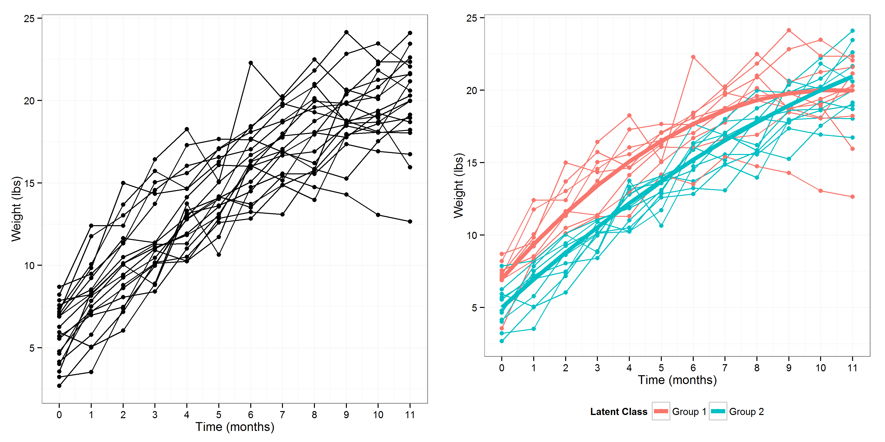

# Background

### Dyslipidemia in Children

\note{How prevalent is dyslipidemia?}

### Cardiovascular disease and dyslipidemia

* Why is dyslipidemia important?
  - A risk factor for cardiovascular disease
  - contributes to the atherosclerotic process.
  
* Dyslipidemia affects xx proportion of the population with notable health disparities across racial/ethnic groups
    - Adverse lipid levels represent strong risk factors for mnay cardiovascular disease outcomes
    - Lipids are targets for intervention because they represent modifiable factors

### Disparities in Lipids

### Dyslipidemia can start in childhood

- How many have it in childhood?
- When you have it how likely are you to maintain dyslipidemia

### Early childhood determinants of chronic disesae

* Researchers have noted a wide range of chronic diseases linked to early life determinants.
    - Birthweight started as one widely noted early life determinant
    - Hypotheses have evolved and now include weight change over time in infancy: growth trajectories.

### Developmental Origins of Health and Disease\footfullcite{Hanson MA; Gluckman PD. Early Developmental Conditioning of Later Health and Disease: Physiology or Pathophysiology? Physiological Reviews. 2014 Oct 1;94(4):1027–76.} (DOoHAD)

\centering

<!--  -->

<!--\note{This figure drives home the importance of intervention at an early age.}-->

### Prior studies point towards association between postnatal growth and dyslipidemia later in life.

\begin{table}[H]
\begin{tabular}{llC{2cm}C{2cm}C{2cm}C{2cm}}
\toprule
 & Author     & Year published & Direction of growth with increase in HDL-C & 2+ observations in change measure & Non-European sample? \\
\midrule
1 & Corvalan   & 2009           & +                                    &              & \ding{52}               \\
2 & Ekelund    & 2007           & +      	                             &               &               \\
3 & Howe       & 2010           & --                              &               &               \\
4 & Kajantie   & 2008           & +                                    &               &               \\
5 & Leunissen  & 2009           & --                              &               &               \\
6 & Oostvogels & 2014           & --                              &               &               \\
7 & Tzoulaki   & 2010           & +                                    & \ding{52}    &              \\
\bottomrule
\end{tabular}
\end{table}

### The postnatal period is a critical window of time in which accelerated growth can influence risk of chronic disease later in life: developmental programming hypothesis

\centering

### Directed Acyclic Graph (DAG)

\begin{figure}
	\caption{Directed Acyclic Diagram (DAG) for research topic.}
	\label{dag1}
 \scalebox{.75}{
	\large{\begin{tikzpicture}[%
		->,
		>=stealth,
		node distance=1cm,
		pil/.style={
			->,
			thick,
			shorten =2pt,}
		]
		\node[color=red] (1) {infant growth};
		\node[right=of 1] (2) {\begin{tabular}{c}dyslipidemia, \\ adolesence \end{tabular}};
		\draw [->] (1) to (2);
	\end{tikzpicture}}
}
\end{figure}

# Specific Aims

## Aims
### Aims

Overall:

  * Investigate the association between postnatal growth trajectories and lipids in adolescence
      - Contemporary Chilean birth cohort with monthly measures of weight in the first year of life
      - High quality clinical measures of cardiovascular disease risk factors.

  * Will investigate postnatal growth trajectories for weight-for-length, weight and length outcome measures.

## Aim 1
### Aim 1

Characterize growth trajectories for infants from 0 to 12 months and what are some significant predictors?

\smallskip

\begin{description}
	\item[Aim 1] Characterize individual growth trajectories in the first year of life and replicate predictors of growth using external validation with an independent sample.
\end{description}

\smallskip

We expect to replicate previous findings \footfullcite{Pizzi C, Cole TJ, Richiardi L, dos-Santos-Silva I, Corvalan C, De Stavola B. Prenatal Influences on Size, Velocity and Tempo of Infant Growth: Findings from Three Contemporary Cohorts. PLoS ONE. 2014 Feb 27;9(2):e90291.} indicating a positive association between:

1. Maternal characteristics such as pre-pregnancy BMI, height and age with trajectory size.

2. Maternal education and trajectory velocity.

### Aim 2

Do certain postnatal growth trajectories associate with dyslipidemia?

\smallskip

\begin{enumerate}[label=Aim 2, leftmargin=*]
	\item Examine the association between postnatal growth trajectories and dyslipidemia.
\end{enumerate}

We expect:

Infants with faster growth trajectories will be more susceptible to dyslipidemia in adolescence.

### Aim 3

\begin{enumerate}[label=Question, leftmargin=*]
  \item Do growth trajectories modify the association between genetic variants related to lipid metabolism and dyslipidemia in adolescence?
\end{enumerate}

\begin{enumerate}[label=Aim 3, leftmargin=*]
	\item Assess gene-environment interaction between growth trajectory characteristics and genetic variants of lipid metabolism with dyslipidemia at 18 years of age as an outcome.
\end{enumerate}

We expect:

1. The selected genetic variants will associate with dyslipidemia in adolescence.
    
2. A gene-environment interaction exists in which extreme and less favorable growth characteristics will exhibit stronger, deleterious associations between the genetic variants and dyslipidemia.

# Approach

### Use SITAR\footfullcite{Beath KJ; Heller GZ.  Latent trajectory modelling of multivariate binary data. Statistical Modelling. 2009 Oct 21;9(3):199-213. Cole TJ; Donaldson MDC, Ben-Shlomo Y. SITAR -- a useful instrument for growth curve analysis. International Journal of Epidemiology. 2010 Jul 20;39(6):1558–66.} method to measure 3 types of postnatal growth: size, tempo, velocity

\note{SITAR: SuperImposition by Translation And Rotation}
\note{These methods are a novel approach to this area of research.}

\centering
  

### Latent growth mixture models (LGMM) can provide unobserved groups of peop

\centering
  

# Preliminary results

### SLCS lipid variants and dyslipidemia in adolescence

# Conclusions

### Strengths and Limitation

* Strengths

* Limitations

### Public Health Implications

- Add information from Messer 2015 paper.

### Future Research

- Put new approaches here. 

<!-- Note: level 3 means that one pound sign is the section (group in header)
# two pound signs is a subsection (group within group in header). three pound signs the frametitle.

Good documentation for beamer use in Rmarkdown:
1. http://rmarkdown.rstudio.com/beamer_presentation_format.html#overview
2. http://svmiller.com/blog/2015/02/moving-from-beamer-to-r-markdown/

Example of their explanation for slide structure in markdown compared to LaTex:

# This is my section
## This is my subsection
### Title of a slide

*Hi mom!*

is the same as

\section{This is my section}
\subsection{This is my subsection}
\frame{
\frametitle{Title of a slide}

\textit{Hi mom!}

}
-->

<!--\color{white}-->

<!-- FULL DAG:

\begin{figure}
	\caption{Directed Acyclic Diagram (DAG) for research topic.}
	\label{dag1}
 \scalebox{.75}{
	\large{\begin{tikzpicture}[%
		->,
		>=stealth,
		node distance=1cm,
		pil/.style={
			->,
			thick,
			shorten =2pt,}
		]
		\node[color=red] (1) {infant growth};
		\node[above =of 1] (2) {breastfeeding};
		\node[left = of 1] (9) {birth weight};
		\node[below=of 9, xshift=-1cm] (3) {genetic factors};
		\node[above right=of 1, yshift=1cm] (4) {child growth};
		\node[above right=of 4] (6) {exercise};
		\node[right=of 1, xshift=2.2cm](13){\begin{tabular}{c}lipid risk allele x\\ infant growth \end{tabular}};
		\node[right=of 13] (5) {\begin{tabular}{c}dyslipidemia, \\ adolesence \end{tabular}};
		\node[above=of 4] (7) {diet};
		\node[above= of 5] (8) {smoking};
		\node[below=of 1] (11) {\begin{tabular}{c}adiposity, \\ early childhood \end{tabular}};
		\node[below left=of 11, xshift=1cm] (10) {male};
		\node[below right=of 1] (12) {\begin{tabular}{c}male x adiposity \\ early childhood \end{tabular}};
		\node[below=of 5](14){\begin{tabular}{c}lipid risk\\allele\end{tabular}};
		\node[above=of 10, xshift=0.5cm, yshift=0.5cm](15){SES};
		\node[above left=of 4](16){SES, child};
		\node[below =of 12](17){ancestry};
		\draw [->] (2) to (1);
		\draw [->] (3) to (9);
		\draw [->] (3) to [bend right=70] (5);
		\draw [->] (6) to (4);
		\draw [->] (7) to (4);
		\draw [->] (7) to (5);
		\draw [->] (6) to (5);
		\draw [->] (8) to (5);
		\draw [->] (9) to (1);
		\draw [->] (1) to (4);
		\draw [->] (1) to (11);
		\draw [->] (11) to (12);
		\draw [->] (1) to (13);
		\draw [->] (13) to (5);
		\draw [->] (10) to (12);
		\draw [->] (10) to (9);
		\draw [->] (10) to (1);
		\draw [->] (12) to (4);
		\draw [->] (14) to (13);
		\draw [->] (14) to (5);
		\draw [->] (15) to (9);
		\draw [->] (15) to (1);
		\draw [->] (16) to (4);
		\draw [->] (17) to (1);
		\draw [->] (17) to (5);
	\end{tikzpicture}}
}
\end{figure}

-->
